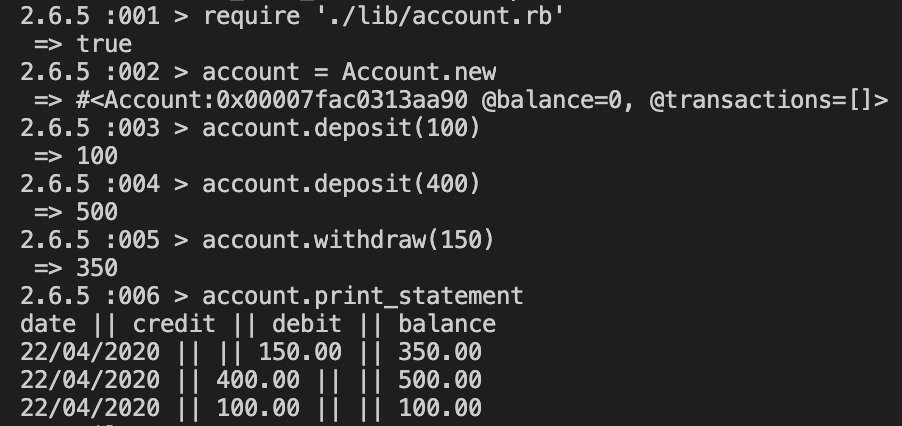

# Bank Tech Test
## Running the program
### Setup
From command line run
```
git clone https://github.com/dariathompson/bank_tech_test.git
cd bank_tech_test
```
### Install dependencies
```
bundle
```
### Run tests
```
rspec
```
### Using in IRB

## Specification
### Requirements
* You should be able to interact with your code via a REPL like IRB or the JavaScript console. (You don't need to implement a command line interface that takes input from STDIN.)
Deposits, withdrawal.
* Account statement (date, amount, balance) printing.
* Data can be kept in memory (it doesn't need to be stored to a database or anything).

### Acceptance criteria
**Given** a client makes a deposit of 1000 on 10-01-2012\
**And** a deposit of 2000 on 13-01-2012\
**And** a withdrawal of 500 on 14-01-2012\
**When** she prints her bank statement\
**Then** she would see
```
date || credit || debit || balance
14/01/2012 || || 500.00 || 2500.00
13/01/2012 || 2000.00 || || 3000.00
10/01/2012 || 1000.00 || || 1000.00
```

## User Stories
```
As a customer,
So I can make transactions,
I want to create bank account
```
```
As a customer,
So I can save money,
I want to make deposits
```
```
As a customer,
So I can get money from my account,
I want to make withdrawals
```
```
As a customer,
So I can check my balance and transactions I've made,
I want to print statement
```
## Approach
* First I created user stories based on requirements and acceptance criteria
* Based on user stories I made my planning and structured my code

| Class          | Account      | Transaction  | Statement    |
| :------------- | :----------- | :----------- | :----------- |
| Attributes | balance, transactions | type, amount, date | account, current_balance |
| Methods | deposit, withdraw, print_statement | | show |

